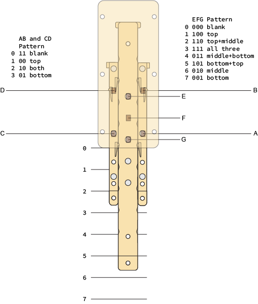

# InSlide Arduino Library Version 1.0.0, October 2022

## What it is.

This an Arduino support library for a strange and nearly useless type of input device 
consisting of one or more mechanical seven-segment display modules each of whose content the 
user sets by operating the module's three sliders to form the digits the user wishes to input. 
After setting the digits for the desired input value in this way, the value of the digits may 
be read using the library. (How the user signals when it's time to read the device is not a 
part of this library.)

A display module looks like this:

## How it works.

On a given module, the left slider controls the vertical segments on the left side of the digit 
display. All the way in, it shows no segments. Pull it out one click and you see the top 
segment. Another click and both segments are displayed. Pulling it out all the way (the next 
click) displays only the lower segment. The right slider works the same way, but for the 
vertical segments on the right side of the display.

The center slider controls the display of the horizontal segments. All the way in: no segments 
are displayed. One click out: Top only. Two clicks: top and middle. Three: top middle and 
bottom. Four: middle and bottom. Five: top and bottom. Six: middle only. Seven: bottom only.

Here's a drawing shows the sliders inside  the device displaying '0'.

In the photo and the drawing, the left and right sliders are pulled out two clicks and the 
center one is out five clicks, causing the module to display the digit '0'.

The backs of the sliders have 4mm disc magnets strategically embedded in them. As the sliders 
are moved, the embedded magnets move over a set of A3144 Hall effect sensors below them, two 
sensors each for the left and right sliders, three for the center slider. 

The drawing above is the view from the rear of the module. It shows the location of the magnets 
on the sliders (the small gray discs) and the location of the sensors (the small semitransparent 
brown patches labeled 'A' through 'G'. The seven sensors are connected to the parallel-load pins 
of an HC165 8-bit parallel/serial load, serial-readout shift register. 

The HC165 is connected to a serial bus consisting of power, ground and four signal lines: clock 
(clk), parallel-load/serial-load (plBar), serial-in (sIn) and serial-out (sOut). These 
daisy-chain from one module to the next. The incoming power, ground, clk and plBar lines 
connect to the Vcc, Gnd, clk and plBar pins of the HC165 and then pass through to the next 
module. The sOut line from the previous module goes to sIn on the HC165 and the HC165 sOut goes 
to the sIn on the next module. The bus's sOut line just passes through from module to module 
without connecting to anything. After the last module there's a bus terminator that connects 
sIn on the bus to sOut and has no connection to the other lines. The Arduino that reads the 
user's input values is connected to the bus input of the first module in the string using the 
+5V (or +3.3V depending on the Arduino) and Gnd pins, and four digital IO pins.

Here's a photo of a module's sensor circuitry taken from the rear of a module with the back cover 
removed. As you can see, it's built dead-bug style:

The photo also shows the incoming bus connector (the black rectangular plug at the top right) a
and the bus terminator (the black plug with the yellow sIn-to-sOut wire at the bottom right). The 
terminator is plugged into the modules outgoing bus socket. The modules are designed to plug 
together to create a multi-digit unit that logically behaves as a long parallel-load, 
serial-readout shift register of sensor values that the Arduino plugged into the right-most module 
controls.

Here's the schematic for a module:

When it's time to read the display, plBar on the bus, which is normally high, is taken low and 
clk is strobed from its usual low state to high and then back. This loads the state of the 
sensors in each module into that module's HC165. The plBar line is then taken low, and the clk 
line is cycled once for each sensor in the entire display. With each rising clk signal, the 
state of next sensor appears on the bus's sOut line.

Obviously, eight clk cycles are needed for each module. But how many modules are there in the 
device? We can figure that out at initialization. First we set the bus sIn line low and then 
cycle clk enough times to clear out the combined shift register of the biggest supported display 
(one with INSL_MAX_DIGITS modules). Then set sIn high and cycle clk until a high appears on sOut. 
The number of cycles that took is the length of the shift register in bits. Divide by 8 and we 
know how many modules there are.

## How to use the library.

Generally, the flow is to instantiate the device as a static global variable, call the begin() 
member function in setup(); and then, when it is time to read the digits the user has set in the 
device, call the update() member function to capture the current data. Finally, call 
getDigitValue(dNo) for each of the device's digits to retrieve their values. 

The library recognizes digit patterns for the hexadecimal digits, 0 ... F. How the program 
interprets them is up to it. Decide the input is hex and allow all the digit values. Decide 
it's decimal and declare the digits A through F are invalid. Or octal and only take 0 through 7. 
Or binary even. The library doesn't support conventional duodecimal, though, because the digits 
&#x218A; and &#x218B; ("dek" and "el" respectively) are ambiguous in a seven-segment display,
dek looking like '5' and el like 'E'. It is possible, as some infidels are reported to have 
done, to use A for dek and B for el. But such practice, obviously, cannot be countenanced.

## Software License Agreement (BSD License)

Copyright (c) 2022 by D. L. Ehnebuke All rights reserved.

Redistribution and use in source and binary forms, with or without
modification, are permitted provided that the following conditions are met:

  1. Redistributions of source code must retain the above copyright
  notice, this list of conditions and the following disclaimer.

  2. Redistributions in binary form must reproduce the above copyright
  notice, this list of conditions and the following disclaimer in the
  documentation and/or other materials provided with the distribution.

  3. Neither the name of the copyright holders nor the
  names of its contributors may be used to endorse or promote products
  derived from this software without specific prior written permission.

THIS SOFTWARE IS PROVIDED BY THE COPYRIGHT HOLDERS ''AS IS'' AND ANY
EXPRESS OR IMPLIED WARRANTIES, INCLUDING, BUT NOT LIMITED TO, THE IMPLIED
WARRANTIES OF MERCHANTABILITY AND FITNESS FOR A PARTICULAR PURPOSE ARE
DISCLAIMED. IN NO EVENT SHALL THE COPYRIGHT HOLDER BE LIABLE FOR ANY
DIRECT, INDIRECT, INCIDENTAL, SPECIAL, EXEMPLARY, OR CONSEQUENTIAL DAMAGES
(INCLUDING, BUT NOT LIMITED TO, PROCUREMENT OF SUBSTITUTE GOODS OR SERVICES;
LOSS OF USE, DATA, OR PROFITS; OR BUSINESS INTERRUPTION) HOWEVER CAUSED AND
ON ANY THEORY OF LIABILITY, WHETHER IN CONTRACT, STRICT LIABILITY, OR TORT
(INCLUDING NEGLIGENCE OR OTHERWISE) ARISING IN ANY WAY OUT OF THE USE OF THIS
SOFTWARE, EVEN IF ADVISED OF THE POSSIBILITY OF SUCH DAMAGE.
